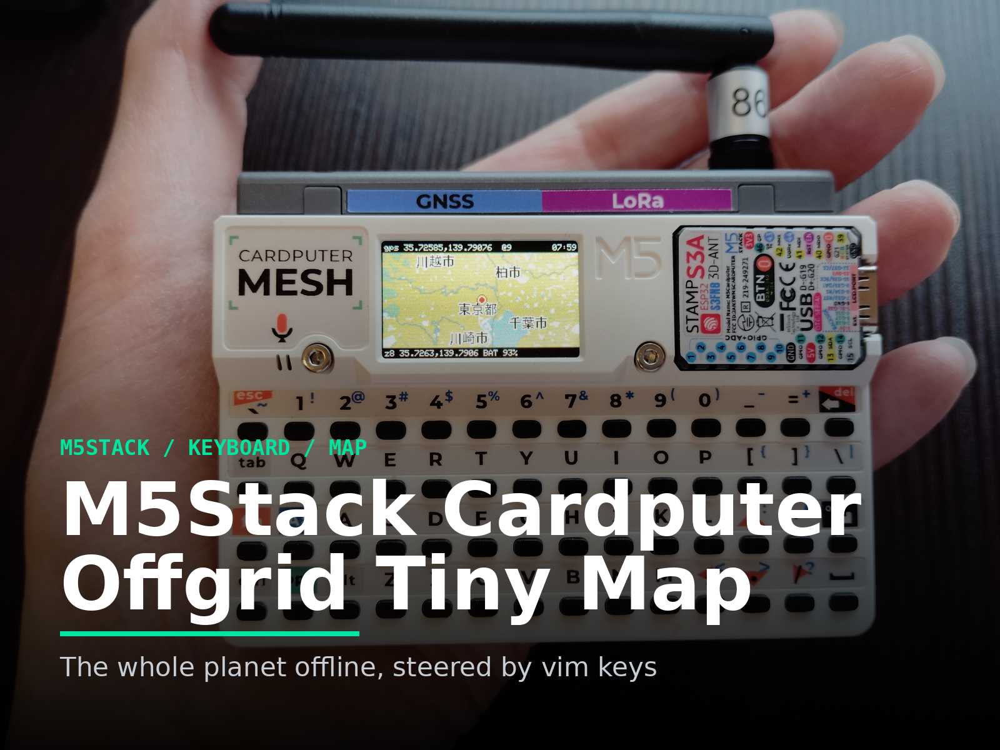
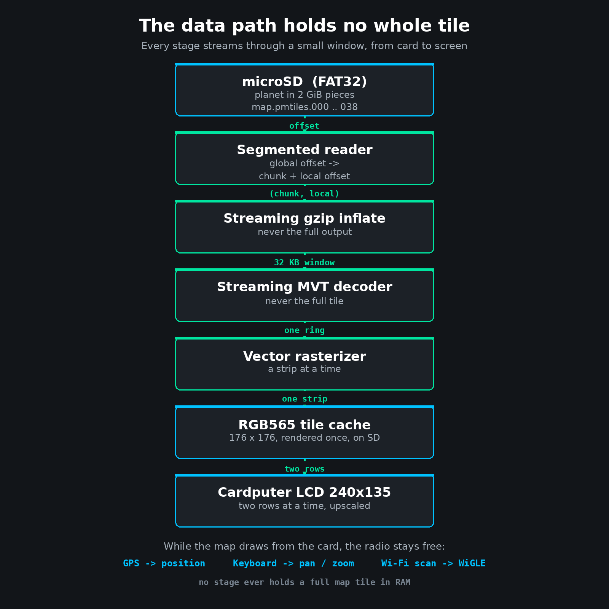

# M5Stack Cardputer Offgrid Tiny Map

> The whole planet offline, steered by vim keys.



An offline map browser for the M5Stack Cardputer. It renders vector tiles
directly from a `planet.pmtiles` file on the microSD card, so drawing the map
needs no network at all. You pan and zoom with vim style keys, and the device
shows its own position from a GPS receiver.

Because the map needs no radio, the Wi-Fi stays free for something else. The
Cardputer can hold a GPS fix and scan for Wi-Fi positioning at the same time,
while the map keeps working off the grid.

For the story of how it was built, including the streaming architecture and the
bugs that only appeared at planet scale, see [HACKSTER.md](HACKSTER.md).

## Features

* Offline vector map rendered on the device from OpenStreetMap based
  `planet.pmtiles`, zoom 0 through 14, with no network needed to draw.
* Streaming everything: no PSRAM, so no full map tile is ever held in RAM.
* Rendered tiles are cached to the card as RGB565, so panning is fast after the
  first visit.
* vim style keyboard controls.
* GPS position from an ATGM336H, which also sets the clock with no network.
* Optional online raster tile mode, with a switchable list of tile sources.
* Optional WiGLE Wi-Fi positioning for indoor use where GPS cannot fix.
* Continuous Wi-Fi scanning, so the device can contribute to WiGLE while the map
  draws from the card.

## Hardware

* M5Stack Cardputer (M5Stamp S3A, an ESP32-S3, with **no PSRAM**).
* A 240 x 135 LCD and a built in keyboard.
* A microSD card, formatted FAT32. 128 GB holds the full planet.
* A Cap LoRa-1262 module carrying an ATGM336H GNSS receiver, for position.

The map itself needs only the Cardputer and a card. GPS needs the LoRa cap.

## Controls

The keys follow vim, because the Cardputer has a real keyboard and `wasd` does
not form a usable cross on its key matrix.

* `h` `j` `k` `l` pan the map.
* `zo` and `zc` zoom in and out.
* `zz` or `gg` jump to the current GPS position.
* `zi` toggles the information bar.
* `r` redraws.
* `Enter` sends a screenshot over serial.
* `:` opens the command line in the bottom bar. Type a command and press Enter.

Both `z` and `g` are prefixes that wait for the next key, exactly as in vim, so
neither is bound to a single action on its own.

Command line entries (type after `:`):

* `:maps` choose the online raster tile source.
* `:maps-reset` restore the default tile source list.
* `:wifi` open the on device Wi-Fi setup screen.
* `:wigle` run WiGLE Wi-Fi positioning.
* `:log` start or stop a GPS track log; `:gpx` convert the last log to GPX.
* `:ss` save a screenshot to the card.
* `:vtclear` clear the rendered tile cache (use after changing the renderer).
* `:intro` show attribution and license.

The device boots at zoom 0 over latitude 0, longitude 0, showing the whole
world, and you fly in from there.

## Build and flash

The firmware uses PlatformIO with the Arduino framework.

```sh
pio run            # build
pio run -t upload  # flash
```

When several ESP32 boards are connected, device numbers like `/dev/ttyACM0` can
change on reconnect, so it is safest to pin the upload port by its stable path
under `/dev/serial/by-id/` in `platformio.ini`.

Host side tests run with an ordinary compiler, no board required:

```sh
./tools/run-tests.sh
```

## Preparing the microSD

### Offline vector map (planet.pmtiles)

You need a planet basemap in PMTiles form, built from OpenStreetMap through the
OpenMapTiles schema, covering zoom 0 through 14. It is about 78 GiB. Obtain or
build it according to that project's instructions and licensing; this repository
does not redistribute the data.

FAT32 cannot hold a single file of 4 GiB or more, so the archive is split into
2 GiB pieces named `map.pmtiles.000`, `map.pmtiles.001`, and so on. The firmware
reads the pieces as one continuous stream.

Use the helper script. It splits with `dd`, checks the PMTiles magic and free
space first, is resumable if the copy is interrupted, and verifies every chunk
against a sha256 manifest by reading the card back:

```sh
tools/split-pmtiles.sh planet.pmtiles /path/to/sd
```

Add `-n` to see the plan (chunk count, free space) without writing anything.
Copying about 78 GiB over a card reader takes tens of minutes; rerun the script
to rewrite any chunk that fails verification. If you would rather do it by hand,
plain `split` also works, but without the resume and readback checks:

```sh
split -b 2147483648 -d -a 3 planet.pmtiles /path/to/sd/map.pmtiles.
```

The card layout is just the pieces at the root. There are no font files to
place: Japanese labels use a font built into the firmware.

```
/
├── map.pmtiles.000
├── map.pmtiles.001
├── ...
├── map.pmtiles.038
└── vtcache/        (created and filled by the firmware on demand)
```

The first view of a new area is slow, because the tile is inflated and rendered
before it is cached. Every later visit reads the cache and is fast.

### Online raster tiles (optional)

Without a `planet.pmtiles`, the firmware can also fetch standard raster tiles
over Wi-Fi and cache them to the card. The tile sources live in `maps.txt`, one
URL per line, and are selectable in the device with `:maps`. Adding a source is
a one line change to `maps.txt`; `tools/gen-map-defaults.py` regenerates
`src/map_defaults.h` at build time.

## Wi-Fi configuration

Wi-Fi is only needed for the online raster mode and for WiGLE positioning, not
for the offline map. Credentials are stored on the device in NVS and on the card
in `/wifi.txt`, and are never committed to this repository. Configure them on
the device with `:wifi`, using the keyboard.

## WiGLE positioning

`:wigle` estimates the position from nearby Wi-Fi access points using the WiGLE
API, which is useful indoors where GPS cannot fix. Like GPS, it only drops a
marker; use `zz` or `gg` to move there. Results are cached on the card so the
same access points are not queried twice. Provide your WiGLE API key with
`:wigle key <name:token>`, or place it in `/wigle.txt` on the card, which the
firmware imports once and then deletes.

## GPS and time

Position comes from the ATGM336H over NMEA. The receiver also carries the time,
so the clock is set with no network and timestamps are correct off the grid. The
raw position is smoothed before display to reduce jitter, and the marker is
drawn in a different colour when the fix cannot be trusted.

## Screenshots

Press `Enter` on the device to send the current frame over serial as an image,
or use `:ss` to save it to the card. Some sample captures are in `docs/`.

## Data path

No stage of the render holds a whole map tile in RAM.



## Attribution and license

* Map data: © OpenStreetMap contributors, under the Open Database License (ODbL).
* Tile schema: OpenMapTiles. Tile archive format: PMTiles.
* Japanese label font: the font built into M5GFX.
* WiGLE: use of the WiGLE API and database is subject to WiGLE's terms.
* This project's firmware: Apache-2.0. See `LICENSE` and `NOTICE`.

If you build on this, keep the OpenStreetMap attribution visible, as the license
requires. The `:intro` screen shows it on the device.

## Related projects

This is part of a small series of tiny map experiments:

* M5AtomS3R Ultra Tiny Map, a 128 x 128 map controlled by tilt and clicks.
* M5Stamp Flying Tiny Map, a map carried by a StampFly drone.

This one is the first that carries its own world, offline.
